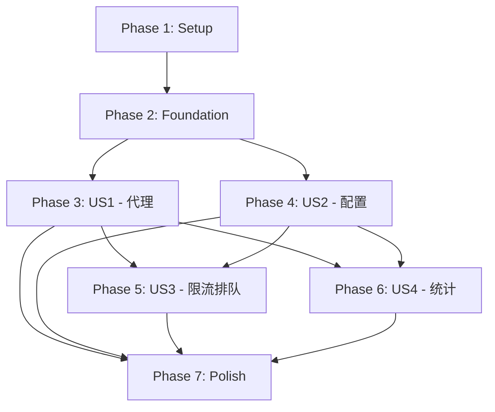

# 任务分解 - LLM API Gateway 网关系统

**功能分支**: `001-api-gateway`  
**创建日期**: 2025-11-23  
**规格文档**: [spec.md](./spec.md)  
**实现计划**: [plan.md](./plan.md)

## 概述

本文档将功能按用户故事优先级分解为可执行的开发任务。每个任务都遵循测试驱动开发（TDD）流程，确保先写测试、再实现功能。

**任务格式说明**:
- `- [ ] T001` - 任务 ID（按执行顺序编号）
- `[P]` - 可并行执行的任务标记
- `[US1]`, `[US2]` 等 - 用户故事标签

**总任务数**: 61  
**估计工时**: 约 15-20 个工作日（2-3周）

---

## Phase 1: 项目初始化与基础设施 (Setup)

**目标**: 搭建项目骨架，配置开发环境和工具链

### 任务清单

- [X] T001 创建项目根目录结构（backend/, frontend/, docs/）
- [X] T002 [P] 初始化 Backend pyproject.toml（UV 配置，声明 FastAPI, httpx, aiosqlite, pytest 等依赖）
- [X] T003 [P] 初始化 Frontend package.json（Vue 3, Vite, axios 等依赖）
- [X] T004 创建 Dockerfile（Backend - 多阶段构建，Python 3.12 slim 基础镜像）
- [X] T005 创建 Dockerfile（Frontend - nginx 服务静态文件）
- [X] T006 创建 docker-compose.yml（编排 backend, frontend, 共享网络）
- [X] T007 创建 Makefile（提供 setup, up, down, test, logs 等命令）
- [X] T008 创建 backend/.gitignore（排除 __pycache__, .venv, *.db, .pytest_cache 等）
- [X] T009 创建 frontend/.gitignore（排除 node_modules/, dist/, .env.local 等）
- [X] T010 编写 README.md（项目介绍、快速开始、技术栈说明）

**验收标准**:
- `make setup` 能成功初始化所有依赖
- `make up` 能启动 backend 和 frontend 服务
- Backend 可访问 http://localhost:8000/health
- Frontend 可访问 http://localhost:5173

---

## Phase 2: 基础设施（数据层与配置） (Foundational)

**目标**: 实现数据模型、数据库初始化和配置管理基础

### 任务清单

- [ ] T011 [P] 编写 ServerConfig Pydantic 模型（backend/src/models/server_config.py）
- [ ] T012 [P] 编写 RequestLog Pydantic 模型（backend/src/models/request_log.py）
- [ ] T013 [P] 编写 UsageStat Pydantic 模型（backend/src/models/usage_stats.py）
- [ ] T014 编写数据库初始化脚本（backend/src/storage/init_db.py，创建 server_configs, request_logs, usage_stats 表）
- [ ] T015 编写数据库操作基类（backend/src/storage/database.py，封装 aiosqlite 连接和 CRUD 操作）
- [ ] T016 实现 API Key 加密工具（backend/src/storage/crypto.py，使用 Fernet 加密/解密）
- [ ] T017 编写应用配置类（backend/src/config.py，从环境变量加载配置）
- [ ] T018 初始化 FastAPI 应用（backend/src/main.py，配置 CORS, 日志, 生命周期事件）

**验收标准**:
- 运行 `python -m src.storage.init_db` 能创建数据库文件和所有表
- 单元测试覆盖所有 Pydantic 模型的验证规则
- API Key 加密/解密测试通过

---

## Phase 3: User Story 1 - 客户端代理 LLM API 调用 (P1)

**目标**: 实现核心代理功能，客户端可通过网关调用 LLM API

### 测试任务

- [ ] T019 [US1] 编写代理端点集成测试（tests/integration/test_proxy.py）
  - 测试场景 1: 带 App-Name header 的请求成功转发
  - 测试场景 2: 根据模型自动选择后端服务器
  - 测试场景 2a: 多服务器支持同一模型时，选择配置顺序中的首个服务器
  - 测试场景 3: 缺少 App-Name header 返回 400
  - 测试场景 4: 后端错误原样返回

### 实现任务

- [ ] T020 [US1] 实现 httpx AsyncClient 全局单例（backend/src/main.py 生命周期管理，timeout=30s, max_connections=200, max_keepalive=50）
- [ ] T021 [US1] 实现服务器配置加载器（backend/src/admin/config.py，从数据库加载配置到内存）
- [ ] T022 [US1] 实现模型路由逻辑（backend/src/gateway/router.py，根据模型名选择服务器，多服务器时使用首次匹配策略）
- [ ] T023 [US1] 实现请求验证中间件（backend/src/gateway/middleware.py，检查 App-Name header）
- [ ] T024 [US1] 实现代理转发核心逻辑（backend/src/gateway/proxy.py，使用 httpx 转发请求）
- [ ] T025 [US1] 实现请求日志记录（backend/src/storage/request_logger.py，异步写入 request_logs 表）
- [ ] T026 [US1] 创建网关 API 路由（backend/src/api/gateway_routes.py，注册 /v1/chat/completions）
- [ ] T027 [US1] 编写契约测试（tests/contract/test_gateway_api.py，验证符合 OpenAPI 规范）

**验收标准**:
- 所有集成测试通过
- 契约测试通过（与 gateway-api.yaml 一致）
- 可通过 Postman/curl 成功调用网关代理请求

---

## Phase 4: User Story 2 - 管理员配置 LLM 后端服务器 (P1)

**目标**: 实现 Admin Console API，支持服务器配置的 CRUD 操作

### 测试任务

- [ ] T028 [US2] 编写服务器配置 API 集成测试（tests/integration/test_admin.py）
  - 测试场景 1: 创建新服务器配置
  - 测试场景 2: 更新服务器配置
  - 测试场景 3: 删除服务器配置
  - 测试场景 4: URL 格式验证失败

### 实现任务

- [ ] T029 [US2] 实现服务器配置 CRUD 服务（backend/src/admin/config.py）
  - create_server(): 创建并加密 API Key
  - get_server(): 查询单个服务器
  - list_servers(): 查询所有服务器
  - update_server(): 更新配置
  - delete_server(): 删除配置
- [ ] T030 [US2] 实现配置动态重新加载（backend/src/gateway/config_loader.py，后台任务每 5 秒轮询）
- [ ] T031 [US2] 创建 Admin API 路由（backend/src/api/admin_routes.py，注册 /api/servers/* 端点）
- [ ] T032 [US2] 编写契约测试（tests/contract/test_admin_api.py，验证符合 OpenAPI 规范）

### 前端任务

- [ ] T033 [P] [US2] 创建 API 服务层（frontend/src/services/api.js，封装 axios 调用）
- [ ] T034 [P] [US2] 实现服务器配置表单组件（frontend/src/components/ServerConfigForm.vue）
- [ ] T035 [P] [US2] 实现服务器列表组件（frontend/src/components/ServerList.vue）
- [ ] T036 [US2] 实现服务器管理页面（frontend/src/pages/Servers.vue，整合表单和列表）
- [ ] T037 [US2] 配置 Vue Router（frontend/src/router/index.js，注册路由）

**验收标准**:
- Admin API 所有端点通过集成测试
- 契约测试通过（与 admin-api.yaml 一致）
- Frontend 能够完成服务器配置的增删改查操作
- 配置变更后 5 秒内网关自动加载新配置

---

## Phase 5: User Story 3 - 请求超限后排队处理 (P2)

**目标**: 实现限流和队列机制，超限请求排队而非拒绝

### 测试任务

- [ ] T038 [US3] 编写限流逻辑单元测试（tests/unit/test_rate_limiter.py）
  - 测试 RPM 限流（Sliding Window Counter）
  - 测试 TPM 限流
  - 测试窗口重置后计数清零
- [ ] T039 [US3] 编写队列逻辑单元测试（tests/unit/test_queue.py）
  - 测试 FIFO 驱逐策略
  - 测试队列超时机制
- [ ] T040 [US3] 编写限流排队集成测试（tests/integration/test_rate_limit.py）
  - 测试场景 1: 第 11 个请求进入队列（RPM=10）
  - 测试场景 2: 窗口重置后队列请求被处理
  - 测试场景 3: TPM 限流触发排队
  - 测试场景 4: 队列超时返回 504

### 实现任务

- [ ] T041 [US3] 实现 Sliding Window Counter 限流器（backend/src/gateway/rate_limiter.py）
  - check_rpm_limit(): 检查 RPM
  - check_tpm_limit(): 检查 TPM
  - cleanup_expired(): 清理过期记录
- [ ] T042 [US3] 实现请求队列管理器（backend/src/gateway/queue.py）
  - enqueue(): 入队（队列满时 FIFO 驱逐）
  - dequeue(): 出队
  - process_queue(): 后台任务处理队列
- [ ] T043 [US3] 集成限流和队列到代理逻辑（修改 backend/src/gateway/proxy.py）
  - 请求前检查限流
  - 超限时入队
  - 队列处理后转发
- [ ] T044 [US3] 实现队列超时处理（backend/src/gateway/queue.py，超时返回 504）

**验收标准**:
- 所有单元测试和集成测试通过
- 限流准确率 >= 95%（允许 Sliding Window 误差）
- 队列排队的请求在窗口重置后 30 秒内处理完成（满足 SC-003）

---

## Phase 6: User Story 4 - 管理员查看用量统计 (P3)

**目标**: 实现用量统计查询和展示功能

### 测试任务

- [ ] T045 [US4] 编写用量统计聚合单元测试（tests/unit/test_stats.py）
  - 测试按小时聚合
  - 测试按天聚合
  - 测试按服务器+应用维度分组
- [ ] T046 [US4] 编写用量统计 API 集成测试（tests/integration/test_stats.py）
  - 测试场景 1: 查询特定服务器+应用的用量
  - 测试场景 2: 按时间范围筛选
  - 测试场景 3: 导出 CSV 报表

### 实现任务

- [ ] T047 [US4] 实现用量统计聚合任务（backend/src/admin/stats_aggregator.py）
  - aggregate_hourly(): 聚合小时数据
  - aggregate_daily(): 聚合日数据
  - 后台任务每分钟运行一次
- [ ] T048 [US4] 实现用量统计查询服务（backend/src/admin/stats.py）
  - get_usage_stats(): 查询统计数据
  - export_usage_csv(): 导出 CSV
- [ ] T049 [US4] 添加用量统计 API 路由（backend/src/api/admin_routes.py，注册 /api/stats/*）

### 前端任务

- [ ] T050 [P] [US4] 实现用量统计图表组件（frontend/src/components/UsageChart.vue，使用 Chart.js）
- [ ] T051 [P] [US4] 实现用量统计表格组件（frontend/src/components/UsageTable.vue）
- [ ] T052 [US4] 实现仪表盘页面（frontend/src/pages/Dashboard.vue，展示图表和表格）

**验收标准**:
- 用量统计准确率 >= 99.9%（满足 SC-005）
- 前端能正确展示按服务器+应用维度的用量数据
- 能导出 CSV 报表

---

## Phase 7: Polish & Cross-Cutting Concerns（打磨与跨功能关注点）

**目标**: 完善日志、错误处理、文档和部署配置

### 任务清单

- [ ] T053 实现结构化 JSON 日志（backend/src/logging.py，使用 structlog）
- [ ] T054 添加健康检查端点（backend/src/api/gateway_routes.py，/health）
- [ ] T055 实现全局异常处理器（backend/src/main.py，统一错误响应格式）
- [ ] T056 优化 Docker 镜像（多阶段构建，减小镜像体积）
- [ ] T057 编写 E2E 测试脚本（tests/e2e/test_full_flow.py，模拟完整用户流程）
- [ ] T058 生成 API 文档（FastAPI 自动文档 /docs, Swagger UI）
- [ ] T059 编写部署文档（docs/deployment.md，生产环境部署指南）
- [ ] T060 代码质量检查（运行 black, ruff, mypy）
- [ ] T061 编写性能压测脚本（tests/performance/test_load.py，使用 locust 或 k6 验证 SC-001 延迟和 SC-002 并发要求）

**验收标准**:
- 所有日志输出为 JSON 格式
- Docker 镜像体积 < 200MB
- E2E 测试覆盖核心用户流程
- 性能测试验证 SC-001（延迟 <50ms）和 SC-002（1000+ 并发）
- 代码通过 black, ruff, mypy 检查

---

## 依赖关系图（User Story 完成顺序）



**关键路径**: Setup → Foundation → US1 → US3 → Polish

**并行机会**:
- Phase 1: T002, T003 可并行
- Phase 2: T011, T012, T013 可并行（不同模型文件）
- Phase 4: T033, T034, T035 可并行（前端组件独立开发）
- Phase 6: T050, T051 可并行

---

## 实现策略

### MVP 范围（最小可行产品）

**建议 MVP = User Story 1 + User Story 2**
- 客户端能通过网关调用 LLM API
- 管理员能配置后端服务器
- 总任务数: T001-T037（约 1.5 周）

**MVP 验收**:
- 完成 Phase 1, 2, 3, 4
- 通过核心集成测试和契约测试
- 能完成端到端基本流程演示

### 增量交付计划

1. **Week 1**: Phase 1-2（Setup + Foundation）
2. **Week 2**: Phase 3-4（US1 + US2）→ MVP 完成
3. **Week 3**: Phase 5-6（US3 + US4）
4. **Week 4**: Phase 7（Polish）→ 生产就绪

---

## 测试策略

### 测试金字塔

```text
       E2E (1个)
      /         \
   集成测试 (15个)
  /              \
单元测试 (30个)
```

**覆盖率目标**:
- 整体代码覆盖率 >= 85%
- 核心业务逻辑（proxy, rate_limiter, queue）>= 95%
- 数据模型和 API 路由 >= 90%

### TDD 工作流

每个功能任务必须遵循：
1. **红色**: 先写测试，运行失败（证明测试有效）
2. **绿色**: 实现最小代码让测试通过
3. **重构**: 优化代码，保持测试通过

---

## 风险与缓解

| 风险 | 影响 | 缓解措施 |
|------|------|----------|
| 限流算法精度不足 | 高 | Phase 5 早期验证，必要时调整为 Token Bucket |
| 队列内存占用过大 | 中 | 设置队列最大长度（默认 100），监控内存使用 |
| 前后端集成问题 | 中 | Phase 4 尽早集成，使用 docker-compose 统一环境 |
| SQLite 并发性能 | 低 | 启用 WAL 模式，后期迁移到 PostgreSQL |

---

## 验收检查清单

### 功能完整性
- [ ] 所有用户故事的验收场景通过
- [ ] 所有功能需求（FR-001 ~ FR-025）实现
- [ ] 所有边界情况有明确处理逻辑

### 质量门禁
- [ ] 所有单元测试通过
- [ ] 所有集成测试通过
- [ ] 所有契约测试通过（符合 OpenAPI 规范）
- [ ] 代码覆盖率 >= 85%
- [ ] 代码通过 black, ruff, mypy 检查

### 成功标准
- [ ] SC-001: 网关延迟 < 50ms（压测验证）
- [ ] SC-002: 支持 1000+ 并发（压测验证）
- [ ] SC-003: 95% 排队请求 < 30s 处理
- [ ] SC-004: 配置变更 < 5s 生效
- [ ] SC-005: 用量统计准确率 >= 99.9%
- [ ] SC-006: 系统可用性 >= 99.5%

### 文档完整性
- [ ] README.md 包含快速开始指南
- [ ] API 文档可通过 /docs 访问
- [ ] 部署文档完整（docs/deployment.md）
- [ ] 所有代码包含中文注释

### 章程合规
- [ ] 所有功能有对应测试代码
- [ ] 所有文档使用中文
- [ ] 使用 UV 管理 Python 依赖
- [ ] 提供 Dockerfile 和 docker-compose.yml
- [ ] Makefile 提供 make test, make run 等命令
- [ ] 使用结构化 JSON 日志
- [ ] 包含集成测试

---

## 附录: 关键文件路径速查

### Backend 核心文件
- `backend/src/main.py` - FastAPI 应用入口
- `backend/src/gateway/proxy.py` - 代理核心逻辑
- `backend/src/gateway/rate_limiter.py` - 限流算法
- `backend/src/gateway/queue.py` - 队列管理
- `backend/src/admin/config.py` - 服务器配置 CRUD
- `backend/src/admin/stats.py` - 用量统计查询
- `backend/src/storage/database.py` - 数据库操作

### Frontend 核心文件
- `frontend/src/pages/Servers.vue` - 服务器管理页面
- `frontend/src/pages/Dashboard.vue` - 仪表盘
- `frontend/src/components/ServerConfigForm.vue` - 配置表单
- `frontend/src/components/UsageChart.vue` - 用量图表
- `frontend/src/services/api.js` - API 调用服务

### 测试文件
- `backend/tests/integration/test_proxy.py` - 代理集成测试
- `backend/tests/integration/test_rate_limit.py` - 限流排队测试
- `backend/tests/contract/test_gateway_api.py` - 网关 API 契约测试
- `backend/tests/contract/test_admin_api.py` - Admin API 契约测试

### 配置文件
- `backend/pyproject.toml` - Python 依赖
- `frontend/package.json` - npm 依赖
- `docker-compose.yml` - 服务编排
- `Makefile` - 任务自动化

---

**文档版本**: 1.0  
**最后更新**: 2025-11-23  
**维护者**: Vega Team
